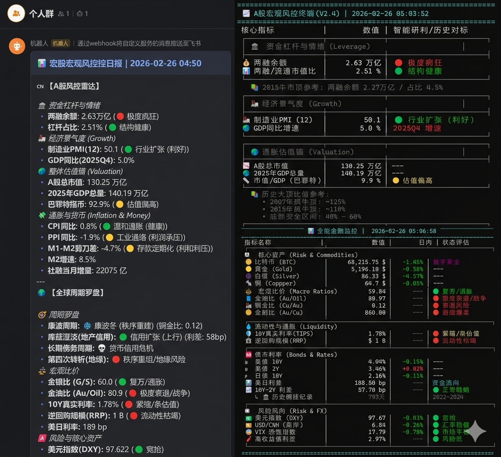

# 📉 宏观金融风控监控终端 (GodMode Macro Terminal)

[](https://www.python.org/)
[](LICENSE)

本项目是一个为投资者设计的**上帝视角**宏观监控工具。它不盯着分时图的波动，而是通过 Python 自动化抓取全球与国内核心宏观指标，结合经典金融理论（康波周期、达利欧债务周期、巴菲特指标等），通过色彩预警实时感知市场冷暖。

---

## 📸 运行效果预览



---

## 🎯 三种使用方式（按难度递增）

### 🟢 小白模式：一键使用 EXE（零代码，零环境）

适合**完全不懂代码**的朋友，只需 3 步：

1. 打开 `一键使用/` 文件夹
2. 用记事本打开 `config.ini`，在引号内粘贴你的 Tushare Token：
   ```ini
   [API_CONFIG]
   TUSHARE_TOKEN = "你的Token粘贴在这里"
   ```
   > 💡 Token 获取方式：前往 [tushare.pro](https://tushare.pro/) 免费注册，在个人主页复制 Token
3. 双击 `宏观金融上帝视角终端.exe`，会自动弹出两个窗口分别显示 A股 和 全球 监控面板

📁 **一键使用文件夹结构：**
```
一键使用/
├── 宏观金融上帝视角终端.exe   ← 双击运行
├── config.ini                 ← 只需填入 Token
└── monitor_all_in_one.py      ← 源码（有能力可自行修改后重新编译）
```

> ⚠️ `config.ini` 必须和 `.exe` 在同一目录下，否则程序无法读取 Token。

---

### 🟡 进阶模式：配置 Python 环境 + BAT 一键运行

适合**有一定编程基础**、想自己调参或查看源码的朋友：

1. 安装 Python 3.8+ 并创建虚拟环境：
   ```bash
   conda create -n macro python=3.9
   conda activate macro
   pip install tushare pandas requests bs4
   ```
2. 在 `monitor_ashare.py` 第 13 行填入你的 Tushare Token
3. 双击对应的 `.bat` 文件即可运行：
   - `run_ashare.bat` → 启动 A 股本地监控终端
   - `run_global.bat` → 启动全球宏观监控终端

> 💡 `.bat` 文件默认使用 Conda 的 `qt` 环境，如果你的环境名不同，请用记事本修改 `.bat` 中的 `activate qt` 为你自己的环境名。

---

### 🔴 高阶玩法：飞书机器人定时自动推送

适合**想实现全自动化运营**的进阶玩家：

1. 在飞书群中添加「自定义机器人」，获取 Webhook 地址
2. 在 `monitor_feishu.py` 第 11 行填入你的 Webhook 链接
3. 运行 `run_feishu.bat` 即可将完整的监控报告以交互卡片形式推送到飞书群

**⏰ 设置每日自动推送（Windows 任务计划程序）：**

1. 搜索并打开系统自带的「**任务计划程序**」
2. 点击右侧「**创建基本任务**」
3. **名称**：填写 `宏观金融自动推送`
4. **触发器**：选择「每天」，设置具体运行时间（建议开盘前，如 `09:10`）
5. **操作**：选择「启动程序」
6. **程序或脚本**：点击浏览，选择 `run_feishu.bat` 的完整路径
7. **起始于（可选）**：**务必填写** `run_feishu.bat` 所在的文件夹路径

> 💡 **进阶建议**：
> - 在任务属性的「设置」选项卡中，勾选「如果任务失败，按以下频率重新启动」，建议每 30 分钟重启一次，最多 3 次
> - 在「条件」选项卡中，取消勾选「只有在计算机使用交流电源时才启动此任务」，确保笔记本电池模式也能推送

---

## 🚀 核心监控逻辑

### 🛡️ A股风控雷达 (`monitor_ashare.py`)
- **杠杆监控**：实时追踪全市场两融余额及其在流通市值中的占比，对标 2015 年牛市顶部数据
- **估值锚点**：基于 Tushare 获取 A 股总市值，对比 2025 年 GDP，自动计算巴菲特指标
- **宏观六维**：PMI（荣枯线）、M1-M2 剪刀差、CPI/PPI、社融增量

### 🧭 全球周期罗盘 (`monitor_global.py`)
- **康波周期**：通过铜金比实时研判复苏/衰退阶段
- **债务周期**：复现 Ray Dalio 长期债务周期逻辑（DXY + Gold）
- **流动性探测**：TIPS 10Y 真实利率、美联储逆回购存量
- **风险风向**：VIX 恐慌指数、高收益债利差、离岸人民币汇率

### 📡 飞书推送引擎 (`monitor_feishu.py`)
- 聚合 A股 + 全球数据，生成完整的 Markdown 交互卡片
- 一键推送至飞书群机器人，支持定时任务自动化

---

## 📂 完整文件结构

```
📁 项目根目录
├── 📁 一键使用/                    ← 小白专用文件夹
│   ├── 宏观金融上帝视角终端.exe
│   ├── config.ini
│   └── monitor_all_in_one.py
├── monitor_ashare.py              ← A股监控核心代码
├── monitor_global.py              ← 全球监控核心代码
├── monitor_feishu.py              ← 飞书推送引擎
├── run_ashare.bat                 ← A股 BAT 启动脚本
├── run_global.bat                 ← 全球 BAT 启动脚本
├── run_feishu.bat                 ← 飞书推送 BAT 脚本
├── show_all.png                   ← 综合效果全景图
├── 📁 demo/                       ← 分解截图文件夹
└── README.md                      ← 本文件
```

---

## 🤖 声明
- 数据来源：[Tushare Pro](https://tushare.pro/)、CNBC、FRED（圣路易斯联储）。跨国接口获取可能需要网络环境支持。
- **风险提示**：本软件仅供宏观研判参考，不构成任何投资建议。指标阈值基于历史极值设定，市场有风险，入市需谨慎。

---
*制作不易，如果这个小工具对你有帮助，欢迎点个 ⭐ Star！*
*欢迎全网关注“今日小散不躺平”，互相交流学习！*

